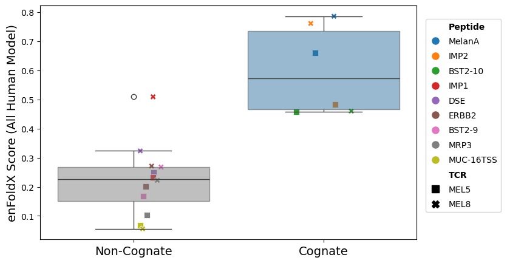

# enFoldX: Leveraging ensembles of in silico structures for complex binding prediction


enFoldX (**En**semble of **Fold**ed Comple**X**es) enables the binding prediction of large datasets of input sequences by extracting distributions of high dimensional confidence features from ensembles of predicted structures. See [our preprint](https://www.biorxiv.org/content/10.64898/2026.07.14.738340v1.full) for more details!

This repo provides code for a pipeline to run enFoldX. This implementation of enFoldX uses AlphaFold3 and runs predictions for complex binding for TCR-peptide-MHC complexes (for class I MHC).


## enFoldX

 


## Terms of Use
By using enFoldX, you are agreeing to the terms set in the enFoldX [Terms of Use](TERMS_OF_USE.md), and the terms of use set by AlphaFold3 (see below).

## Issues / Contact
If you have any issues running enFoldX or any questions about the code or the method, please file an issue on the repository or [reach out directly via email](mailto:levinej4@mskcc.org).

## Requirements
To install and run enFoldX and AlphaFold3, you will need:
- python (conda or pip preferred for dependencies)
- docker or singularity (to run the AF3 container)
- ~1TB of space (for AF3 databases)
- A GPU that can run AF3 (see [https://github.com/google-deepmind/alphafold3/]([https://github.com/google-deepmind/alphafold3/]))

## enFoldX Installation
Clone the repository:

```bash
git clone --depth 1 https://github.com/jonlevi/enFoldX.git
cd enFoldX
```
Alternatively, you can download the zip file directly using the "download" option on the repository options. Either clone or download should complete in <5 minutes. If you don't include `--depth 1`, it will be a bit slower since some of the older git history has some large files.

The python requirements to run these scripts are fairly minimal and you can run
```bash
conda env create -f environment.yml
conda activate enfoldx_env
```
to create a `enfoldx_env` virtual environment, and then activate it. The environment includes the basic toolkit (numpy, pandas, etc.) as well as a few tools that we interact with (biopython etc.).

## Getting Started: AlphaFold3 Installation
Right now you can run enFoldX with AF3 locally installed (i.e. on your HPC or server). We include detailed instructions [below](#run-alphafold3-predictions).

 **At the moment, our pre-trained VDJdb models can only be run using the local installation of AF3.**  
 
 There are some differences in the way the server processes inputs than the local installation, and so our pre-trained models are not calibrated for server outputs. We are actively working on setting up compatibility with AF3 server-based predictions, see [this issue](https://github.com/jonlevi/enFoldX/issues/4) for details. In general, we highly recommend using local installation of AF3 for enFoldX anyway, as it allows for the incorporation of multiple seeds at the same time. Currently, AlphaFold Server runs just one seed for each job. If you want to sample multiple seeds, you need to run multiple identical job submissions with different input seeds, and then collect the results yourself, but this is rather hard to scale up. You also cannot separate the MSA steps from the diffusion steps on the AF3 server, which also limits your ability to re-use MSAs, which is critical for efficient prediction of the same TCR against multple potential peptides.

We provide step-by-step tutorials for how to use enFoldX for either the installed AF3 as for the server AF3:

To run enFoldX, you need to essentially run 3 main steps:
1) [Prepare sequence inputs](#prepare-sequence-inputs)
2) [Run Structure Predictions and Extract Features](#run-alphafold3-predictions)
3) [Predict binding](#predict-binding) <--- Currently only available for locally installed pipeline!

The first step is detailed below. The second step for running AF3 can be found in the companion tutorial files, depending on if you are using the local installation or the server.

# enFoldX Tutorial

## Step 0: Tutorial data
For this tutorial, we will be analyzing two TCRs from Dolton et. al.[^1], MEL8 and MEL5, together with 9 peptides (3 cognates, 6 non-cognates). See the paper for details. We downloaded the VDJ calls and peptides and copied them to `examples/MEL_data/`.

If you want to see what the results look like at each step of the pipeline, please download the tutorial data from [here](https://github.com/jonlevi/enFoldX/releases/download/v0.1.0/enfoldx_tutorial_data.zip). 

## Step 1: Prepare sequence inputs

### TCRs
In order to run this pipeline, you will need a file that contains one row per TCR-pMHC complex that you wish to predict. If you already have full length TCR sequences, you can skip this step. For instructions on how to go from `V`, `J`, `CDR3` calls to full length TCR sequences, have a look at our [tutorial](https://github.com/jonlevi/enFoldX/blob/main/docs/format_tcr_sequences.md). (Note that full length includes leader/constant/framework sequences, not just the variable regions). Please note that stitchr outputs a TSV, but the required input for the first step below is a CSV. For the tutorial MEL TCRs, the result of running stitchr should give you a TSV that looks like `examples/MEL_data/MEL_tcrs_stitchr_out.tsv`. 

### MHC
You will also need the full length sequences for any MHC/HLA chains you want to model. For MHC sequence information, you can look up the allele in [Uniprot](https://www.uniprot.org/uniprotkb) or IPD-IMGT/HLA at https://www.ebi.ac.uk/ipd/imgt/hla/alleles/. For convenience, we include the [sequences of many common HLA alleles](https://github.com/jonlevi/enFoldX/blob/main/MHC_sequences/) together with our repo. For the tutorial MEL TCRs, the HLA is HLA-A0201, whose sequence we copy from [there](https://github.com/jonlevi/enFoldX/blob/main/MHC_sequences/HLA-A*02:01.fasta). 

### Output
In order to continue with the next steps, you need a CSV that has columns containig the full-length amino acids sequences for the TCRa, TCRb, MHC, and peptide sequence per row. It also must contain the sequences of the CDR3a and the CDR3b, which must be substrings of the TCRa and TCRb respectively, and a unique complex_id to identify the row. Don't include any spaces or weird characters in the complex_id column, since it may conflict with AlphaFold3 required naming conventions and cause an error. Your CSV should look something like this:

| complex_id | TRA_aa    | TRA_CDR3         | TRB_aa    | TRB_CDR3        | M_aa      | peptide   |
|------------|-----------|------------------|-----------|-----------------|-----------|-----------|
| complex_1  | MDSSPG... | CALGDPPNTGKLTF   | MGSRL...  | CASTSGVGQDTQYF  | MVPCTL... | TVYGFCLL  |
| complex_2  | MLILS...  | CAMRSSGGSNAKLTF  | MGAMA...  | CASSGGANTGQLYF  | MVPCTL... | ASNENMETM |

etc.

(Note: the column names above are the default names for all of the scripts in the enFoldX code, but you can override with custom column names by passing in the apporpirate flags to each script with
`[-i ID_COL] [-a <ALPHA_COL_NAME>] [-b <BETA_COL_NAME>] [-m <MHC_COL_NAME>] [-p <PEPTIDE_COL_NAME>] [-cdr3a <CDR3A_COL_NAME>] [-cdr3b <CDR3B_COL_NAME>]`).

For the tutorial MEL TCRs, you can see the full formatted input CSV at ```examples/MEL_data/MEL_enfoldx_input.csv```.


## Step 2: Run AlphaFold3 Predictions

There are currently 2 ways to run AlphaFold3 predictions:
- [Tutorial for local installation of AF3](docs/TUTORIAL.md)
- [Tutorial for AF3 server](docs/TUTORIAL_SERVER_BASED.md)

After following the steps in either of those tutorials, you should have a CSV called `ensemble_features.csv` with the enFoldX feature set described in the paper. For the local installation, this CSV can be used to predict binding below with our pre-trained models, with means and std of each of the features across the ensemble.
(The output also contains `all_structures_features.csv` - which contains the full ensemble without any collapsing,  `avg_features.csv` - only the average values over the ensemble, and `best_features.csv` the highest-ranked structure from the ensemble.)

For the pre-trained enFoldXs models below, you will need to use `ensemble_features.csv`. Once you have that CSV, you can continue to the next step here.

## Step 3: Predict Binding

You can either train your own classifier using features generated in the steps above (on a meaningfully large labeled dataset, such as VDJdb), or use one of the pretrained models provided in the `models/` directory. **These models are currently only calibrated for AF3 local installation outputs and not for server-based outputs**.

A detailed description of the available models is provided in [`models/MODELS.md`](models/MODELS.md). In brief:
- **human** (`enFoldX_human_vFebSept_DecoyPerm`): trained on VDJdb human data with decoy and permuted negatives (10-seed ensemble). We recommend this model for general TCR:pMHC predictions.
- **human_decoy** (`enFoldX_human_vFebSept_Decoy`): trained on VDJdb human data with decoy negatives (10-seed ensemble). This model performs best on mutational scan datasets, and T Cell cross-reactivity tasks like the MEL TCRs. 
- **mouse** (`enFoldX_mouse_vFeb_Decoy`): trained on VDJdb mouse data with decoy negatives (10-seed ensemble). Use it for mouse TCR:pMHC predictions.
- **human_1seed** (`enFoldX_human_vFebSept_DecoyPerm_1seed`): trained on VDJdb human data with decoy and permuted negatives (a 1-seed ensemble, using 5 AF3 samples for just 1 AF3 seed for quickest runtime). If your test dataset contains features for only 1 AF3 seed, please use this model.

Each pretrained model is packaged together with its corresponding feature scaler. The script `get_cognate_predictions.py` automatically loads the selected model together with its corresponding scaler, scales the input features to the model's training feature space, generates and saves predicted probabilities of cognate TCR:pMHC binding:

```bash
usage: get_cognate_prediction.py [-h] -f FEATURES_FILE [-m {human,human_decoy,mouse,human_1seed}] -o OUTPUT_DIR [-of OUTPUT_FILENAME]

options:
  -h, --help            show this help message and exit
  -f FEATURES_FILE, --features-file FEATURES_FILE
                        Path to input file with enFoldX features (default: None)
  -m {human,human_decoy,mouse,human_1seed}, --model {human,human_decoy,mouse,human_1seed}
                        Pre-trained enFoldX model to use. (default: human)
  -o OUTPUT_DIR, --output-dir OUTPUT_DIR
                        Directory to save the output CSV file with enFoldX scores. (default: None)
  -of OUTPUT_FILENAME, --output-filename OUTPUT_FILENAME
                        Filename for output CSV file with enFoldX scores. (default: enFoldX_predictions.csv)
```

For the MEL TCRs, this script would be called like this, using the default human model:
```
python ./scripts/get_cognate_prediction.py -f examples/enfoldx_extracted_features/ensemble_features.csv -m human -o examples/enfoldx_predictions/ 
```
and the results are written to ```examples/enfoldx_predictions/enFoldX_predictions.csv```. Here is what the results should look like for the MEL TCRs:

 

As with any supervised machine learning approach, model performance depends on the quality and relevance of the training data. If your target dataset differs substantially from published datasets such as VDJdb, we recommend first running the enFoldX pipeline to generate structural ensemble features, then training your own classifier on a labeled dataset that closely matches your intended application before applying it to new data.

Please use the 10-seed models (the first three models above) if you generate features for 10-seed structural ensembles. **If you only generate AF3 structures for 1 seed, we recommend using a 1-seed model** (i.e. human_1seed model above), as performance will be slightly worse with a 10-seed model.

Note that if you don't use the same sequence pre-processing as we recommend (for example, don't use Stitchr and instead use TCR sequences without the leader sequences), the feature ranges will differ from the ones used for the pretrained models, and the performance will be severely degraded. In that case, we recommend that you **consistently preprocesses all your training data** in the same way, extract features as above, and train your own classifier model.

## Other Useful Things 
###  Access to labeled mutational scan data used in our paper

If you are looking for the labeled mutational scan datasets used for validation our paper, please visit the ```manuscript/data/mutational_scan_data``` folder. The other datasets used in the paper can be accessed directly from their original publications, as described in the methods section.

### RMSD Calculations
You can also run the pairwise RMSD calculations for assessing the structural diversity of an ensemble of predicted TCR:pMHC structures, as used in the first section of our paper. Run the script passing in the paths for the AF3 output directory with the predicted ensemble and a directory to store a CSV containing the RMSD metrics:

```bash
usage: compute_pairwise_rmsd.py [-h] -d DATA_DIR -o OUTPUT_DIR

Compute pairwise RMSD metrics of AF3-predicted ensemble. Note this is currently only implemented for AF3 Installed version and not for the
server version

options:
  -h, --help            show this help message and exit
  -d DATA_DIR, --data-dir DATA_DIR
                        Path to directory containing AF3-predicted ensemble. (default: None)
  -o OUTPUT_DIR, --output-dir OUTPUT_DIR
                        Path to directory to write output CSV. (default: None)
```

 For example:
```bash
python ./scripts/compute_pairwise_rmsd.py -d examples/af3_fold_outputs/mel8_mrp3/ -o  examples/pairwise_rmsd_example/
```
You can look at sample output in ```examples/pairwise_rmsd_example/pairwise_rmsd.csv```. Note, this script can be sped up by allocating additional cores, as mdtraj can make use of parallelization under the hood, as explained [here](https://mdtraj.readthedocs.io/en/latest/api/generated/mdtraj.rmsd.html#mdtraj.rmsd) 

[^1]: Dolton G, Rius C, Wall A, Szomolay B, Bianchi V, Galloway SAE, Hasan MS, Morin T, Caillaud ME, Thomas HL, Theaker S, Tan LR, Fuller A, Topley K, Legut M, Attaf M, Hopkins JR, Behiry E, Zabkiewicz J, Alvares C, Lloyd A, Rogers A, Henley P, Fegan C, Ottmann O, Man S, Crowther MD, Donia M, Svane IM, Cole DK, Brown PE, Rizkallah P, Sewell AK. Targeting of multiple tumor-associated antigens by individual T cell receptors during successful cancer immunotherapy. Cell. 2023 Aug 3;186(16):3333-3349.e27. doi: 10.1016/j.cell.2023.06.020. Epub 2023 Jul 24. PMID: 37490916.
